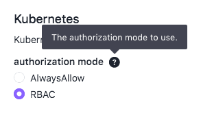

# 授权

DC/OS Kubernetes 支持以下
[Kubernetes 授权模式](https://kubernetes.io/docs/reference/access-authn-authz/authorization/#authorization-modules)：

- `AlwaysAllow`，默认、全宽容模式
- `RBAC`，更细粒度地控制 **谁** 可以访问 哪个 Kubernetes API 资源。

<p class="message--important"><strong>警告</strong>安装包时必须选择集群的授权模式。不支持在安装包后更改授权模式。</p>


## `AlwaysAllow`

DC/OS Kubernetes 中的默认授权模式是 `AlwaysAllow`。这意味着，
将授权对 Kubernetes API 的每个身份认证请求。

## `RBAC`

要启用 `RBAC` 授权模式，用户必须将
 `kubernetes.authorization_mode` 配置属性的值设置为 `RBAC`。安装包时会完成此设置，或者通过 UI：



图 1. 授权模式

或者，通过 CLI，使用自定义选项：

```json
{
  "kubernetes": {
    "authorization_mode": "RBAC"
  }
}
```

## 允许用户访问 Kubernetes API

此包不提供与 DC/OS 身份认证或
授权的集成，这意味着 DC/OS 用户不是有效的 Kubernetes 用户。
这意味着：

- Kubernetes API Users 将被建模为 Kubernetes 服务帐户；
- 安装程序将创建拥有超级用户权限的用户 (`bootstrapper`) 
 （`cluster-admin` 集群角色），之后
 操作员可以用其添加更多用户，以及其各自的权限（如果 `RBAC`
 授权模式已启用）。

<p class="message--important"><strong>警告</strong>我们 <strong>强烈建议</strong> 您为每个希望访问 Kubernetes 集群的用户创建服务帐户（例如，使用 <tt>kubectl 创建服务帐户</tt>)，并仅向此服务帐户提供每个用户所需的权限（例如，使用 <tt>kubectl 创建 [集群] 角色绑定</tt>）。
我们也 <strong>强烈建议</strong> 您为自己创建新服务帐户，并完全删除 <tt>bootstrapper</tt> 服务帐户。</p>

